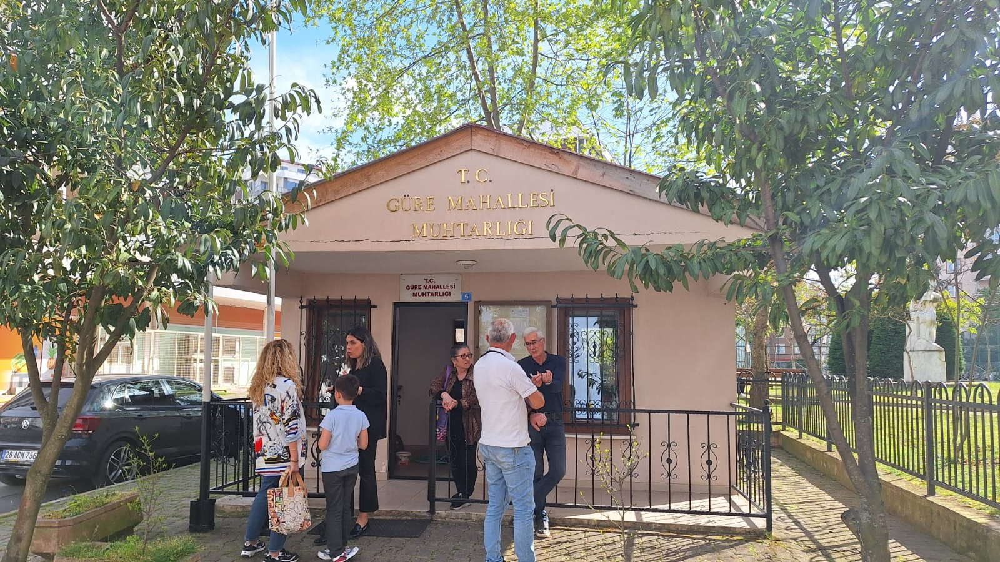

Hoş Geldiniz!
---

Giresun'un tarih ve doğanın kucaklaştığı eşsiz mahallemiz, sizi selamlıyor! Güre Mahallesi'nin resmi web sitesine hoş geldiniz. Burada mahallemizin tarihini, kültürünü, doğal güzelliklerini ve etkinliklerini keşfetmeye hazır mısınız?

Mahalle Hakkında
---

Güre Mahallesi, Giresun'un göz kamaştırıcı sahil şeridinde yer alan bir cennettir. Doğal zenginlikleriyle ünlü olan mahallemiz, tarihi dokusu ve sıcak insanlarıyla da göz doldurur. Siz de bu eşsiz atmosferde yaşamın tadını çıkarabilir, mahallemizin sunduğu olanaklardan yararlanabilirsiniz.

Keşfedin
---

Tarih ve Kültür: Güre Mahallesi'nin zengin tarihini ve kültürünü keşfedin. Eski Rum evleri, tarihi camiler ve daha fazlası sizi bekliyor.
Doğal Güzellikler: Eşsiz sahil manzarası, temiz havası ve yeşil doğasıyla Güre Mahallesi, doğaseverler için bir cennettir.
Etkinlikler: Mahallemizde düzenlenen etkinlikler ve festivaller hakkında bilgi alın. Keyifli etkinliklere katılarak mahalle sakinleriyle tanışın.
Haberler ve Duyurular

En güncel haberler ve mahalleyle ilgili duyuruları buradan takip edebilirsiniz. Mahalle yaşamına dair önemli gelişmeleri kaçırmayın!

İletişim
---

Siz de Güre Mahallesi ile ilgili sorularınızı, önerilerinizi veya geri bildirimlerinizi bizimle paylaşabilirsiniz. İletişim bilgilerimizden bize kolayca ulaşın.

Sosyal Medya Bağlantıları
---

Güre Mahallesi'ni sosyal medyada takip edin ve güncel haberlerden haberdar olun. Facebook, Instagram ve Twitter'da bizi takip etmeyi unutmayın!

Güre Mahallesi'ni Keşfedin, Yaşamın Tadını Çıkarın!